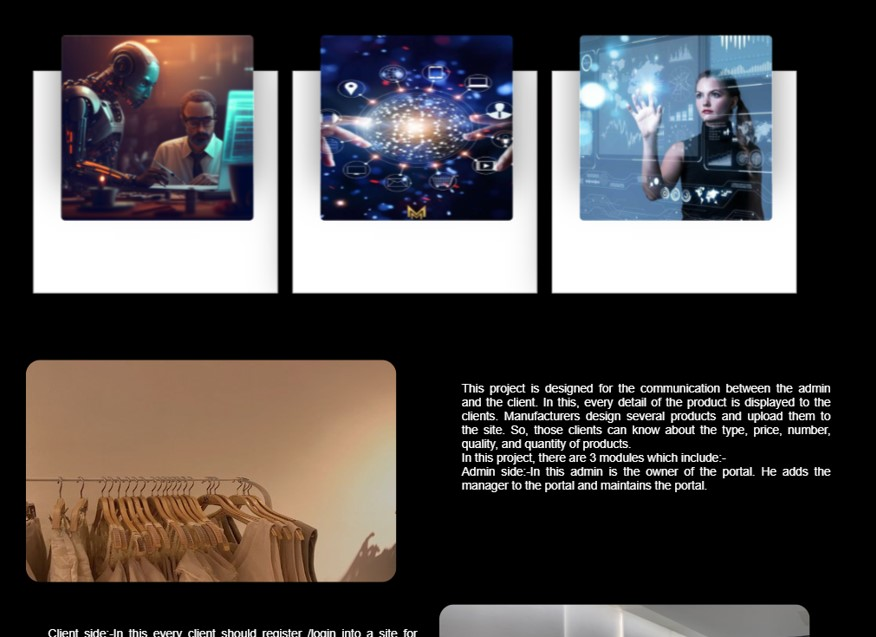

# shopping-website

Overview
Welcome to the Shopping Website repository! This project contains a comprehensive e-commerce website built using HTML, CSS, JavaScript, images, Python, MySQL, and Django. The website offers a user-friendly interface for browsing products, making purchases, and managing orders, powered by a robust backend infrastructure.

Features
Product Catalog: The shopping website features a diverse product catalog with categories, descriptions, images, and prices, allowing users to discover and explore items of interest.
User Authentication: Users can create accounts, sign in, and manage their profiles, addresses, and payment methods securely.
Shopping Cart: Users can add products to a shopping cart, update quantities, and proceed to checkout to complete their purchases.
Checkout Process: A streamlined checkout process with multiple payment options, order summary, and confirmation ensures a smooth transaction experience.
Backend Infrastructure: The website is powered by Django and MySQL, providing a scalable and reliable backend infrastructure for managing products, orders, users, and other data.
Responsive Design: The shopping website is designed to be responsive, ensuring optimal viewing and functionality across various devices and screen sizes.
Image Assets: The repository includes image assets used for showcasing products, such as product images, logos, or banners.

Usage
Clone the repository to your local machine.
Set up a virtual environment and install the required dependencies specified in the requirements.txt file.
Configure the Django settings to connect to your MySQL database and set up necessary migrations.
Run database migrations to create tables and populate initial data.
Start the Django development server and open the website in a web browser to view the shopping website.
Customize the website's layout, styling, and functionality in the HTML, CSS, JavaScript, and Python files to suit your specific requirements.
Populate the product catalog with your products, including descriptions, images, prices, and other relevant information.
Test the shopping website thoroughly to ensure functionality, usability, and compatibility across different browsers and devices.
Deploy the shopping website to a web server or hosting platform to make it accessible to users.
Monitor website analytics, user feedback, and sales data to optimize performance and user experience over time.

